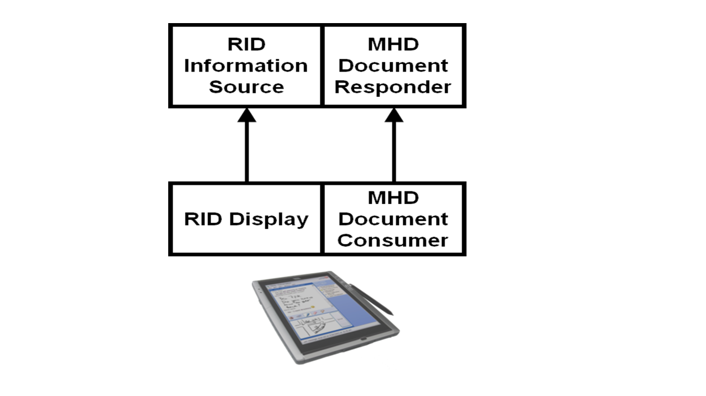

Considerations when applications group MHD actors with other IHE actors.

#### 1:33.6.1 MHD Actor grouped with XDS infrastructure

When the MHD Document Recipient is acting as a proxy for an XDS environment, it could be grouped with an XDS Document Source as the “XDS on FHIR” Option defines. In this way, a received Provide Document Bundle [ITI-65] transaction would be converted by the grouped system into an XDS Provide and Register Document Set-b [ITI-41] transaction. The MHD Document Recipient, acting as a proxy, could be configured to support only a designated set of mobile devices authorized by the hosting organization and use the security model defined by that hosting organization. The proxy might convert user authentication credentials, and fully implement the ATNA Secure Node or Secure Application Actors. 

Other proxy architectures to XDS are possible such as grouped with an XDS Integrated Document Source/Repository.

When the MHD Document Responder is acting as a proxy for an XDS environment, it could be grouped with an XDS Document Consumer. In this way, the MHD Find Document Lists [ITI-66], Find Document References [ITI-67], and Retrieve Document [ITI-68] transactions will be supported in the system using the appropriate XDS Registry Stored Query [ITI-18] and Retrieve Document Set-b [ITI-43] transactions. This proxy would be configured to support a designated set of mobile devices and the security model defined by the hosting organization. The proxy might fill in missing metadata information, convert user authentication credentials, and fully implement the IHE ATNA Secure Node or Secure Application Actors.

Not diagrammed here is how [PDQm](https://profiles.ihe.net/ITI/TF/Volume1/ch-38.html) and/or [PIXm](https://profiles.ihe.net/ITI/TF/Volume1/ch-41.html) could similarly be used and implemented.

These two environments are illustrated in Figure 1:33.6.1-1.

**Figure 1:33.6.1-1: MHD Actors grouped with XDS Document Sharing**

#### 1:33.6.2 MHD Actors grouped with XCA infrastructure

When an MHD Document Responder acts as a proxy into an XCA environment, it could be grouped with an Initiating Gateway. This type of MHD Document Responder will support the Find Document Lists [ITI-66], Find Document References [ITI-67], and Retrieve Document [ITI-68] transactions by utilizing the XCA Cross Gateway Query [ITI-38] and Cross Gateway Retrieve [ITI-39] transactions as necessary. This type of proxy would be configured to support a designated set of mobile devices and enable a security model as defined by the hosting organization. The proxy might fill in missing metadata information, convert user authentication credentials, and fully implement the ATNA Secure Node or Secure Application requirements.

**Figure 1:33.6.2-1: MHD Actors grouped with XCA**

#### 1:33.6.3 MHD Actor grouped with Retrieve Information for Display (RID) Profile

The Retrieve Information for Display (RID) Profile includes a similar set of transactions to those defined in the MHD Profile for Document Consumer. The RID Profile is focused more on delivering display-ready health information that may or may not be document based, whereas the MHD Profile focuses on providing access to Documents and the metadata about the document. Grouping the RID Information Source with an MHD Document Responder will provide both access to the metadata and document content, and also access to display-ready information. 

**Figure 1:33.6.3-1: MHD Actors grouped with RID**
