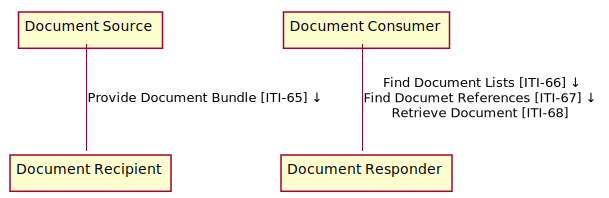

<!-- actors_and_transactions.md 
*****************************************************************************************
*                            WARNING: DO NOT EDIT THIS FILE                             *
*                                                                                       *
* This file is generated by SUSHI. Any edits you make to this file will be overwritten. *
*                                                                                       *
* To change the contents of this file, edit the original source file at:                *
* ig-data/input/pagecontent/2_actors_and_transactions.md                                *
*****************************************************************************************
 -->

This section defines the actors and transactions in this implementation guide.

Figure below shows the actors directly
involved in the MHD 
Profile and the relevant transactions between them.

**Figure: MHD Actor Diagram**

Table 3-1 lists the transactions for each actor directly involved in the MHD Implementation Guide. To claim compliance with this guide, an actor shall
support all required transactions (labeled "R") and may support the
optional transactions (labeled "O").

<table border="1" borderspacing="0" style='border: 1px solid black; border-collapse: collapse'>
<caption>
<b>
Table 3-1: MHD Implementation Guide - Actors and Transactions
</b>
</caption>
<thead>
<tr class="odd" style='background: gray;'>
<th>Actors</th>
<th>Transactions</th>
<th>Optionality</th>
</tr>
</thead>
<tbody>
                
<tr class="even">
                        
<td rowspan="1">
<a href="actors_and_transactions.html#document-source">Document Source</a>
</td>
                        
<td>
<a href='transaction-65.html'>
                        Provide Document Bundle [ITI-65]
</a>
</td>
<td align='center'>
                        R
</td>
</tr>

<tr class="even">
                        
<td rowspan="1">
<a href="actors_and_transactions.html#Document Recipient">Document Recipient</a>
</td>
                        
<td>
<a href='transaction-65.html'>
                        Provide Document Bundle [ITI-65]
</a>
</td>
<td align='center'>
                        R
</td>
</tr>
                    

                    
<tr class="even">
                        
<td rowspan="3">
<a href="actors_and_transactions.html#document-consumer">Document Consumer</a>
</td>
                        
<td>
<a href='transaction-66.html'>
                        Find Document Lists [ITI-66]
</a>
</td>
<td align='center'>
                        R
</td>
</tr>
                    
<tr class="odd">
                        
<td>
<a href='transaction-67.html'>
                        Find Document References [ITI-67]
</a>
</td>
<td align='center'>
                        R
</td>
</tr>

<tr class="even">
                        
<td>
<a href='transaction-68.html'>
                        Retrieve Document [ITI-68]
</a>
</td>
<td align='center'>
                        R
</td>
</tr>

                    
<tr class="odd">
                        
<td rowspan="3">
<a href="actors_and_transactions.html#document-responder">Document Responder</a>
</td>
                        
<td>
<a href='transaction-66.html'>
                        Find Document Lists [ITI-66]
</a>
</td>
<td align='center'>
                        R
</td>
</tr>
                    
<tr class="even">
                        
<td>
<a href='transaction-67.html'>
                        Find Document References [ITI-67]
</a>
</td>
<td align='center'>
                        R
</td>
</tr>

<tr class="odd">
                        
<td>
<a href='transaction-68.html'>
                        Retrieve Document [ITI-68]
</a>
</td>
<td align='center'>
                        R
</td>
</tr>                    
</tbody>
</table>
        
        
            

### Actors
The actors in this profile are described in more detail in the sections below.

#### Document Source

The Document Source is the producer and publisher of documents and metadata.

##### Document Consumer

The Document Consumer queries for document metadata meeting certain criteria and may retrieve selected documents.

#### Document Recipient

The Document Recipient receives documents and metadata sent by another actor.

#### Document Responder

The Document Responder sends documents and/or metadata in response to a request from another actor.        

### Actor Options

Options that may be selected for each actor in this implementation guide, are listed in Table 3.2-1 below. Dependencies 
between options when applicable are specified in notes.

<table border="1" style="border: 1px solid black; border-collapse: collapse">
    <caption><b>Table 3.2-1 Actor Options</b></caption>
    <thead>
        <tr style="background: gray;" class="odd">
            <td>Actor</td>
            <td>Option Name</td>
        </tr>
    </thead>
    <tbody>
        
                <tr>
                
                    <td rowspan='1'>Document Source</td>
                
                <td><a href="#comprehensive-metadata-option">Comprehensive Metadata</a></td>
                </tr>
            
                <tr>
                
                    <td rowspan='2'>Document Recipient</td>
                
                <td><a href="#comprehensive-metadata-option">Comprehensive Metadata</a></td>
                </tr>
                <tr>
                
                <td><a href="#XDS-on-FHIR-option">XDS on FHIR</a></td>
                </tr>
                        
                <tr>
                
                    <td rowspan='1'>Document Consumer</td>
                
                <td>No options defined</td>
                </tr>
            
                <tr>
                
                    <td rowspan='1'>Document Responder</td>
                                
                <td><a href="#XDS-on-FHIR-option">XDS on FHIR</a></td>
                </tr>
    </tbody>
</table>

        
The options in this guide are describe in more detail the sections below.

#### Comprehensive Metadata Option

Support of this option assures that the Document Source will provide comprehensive metadata. Comprehensive metadata fulfill the cardinality requirements of XDS. 
A Document Source that supports this option will provide metadata consistent with the additional document sharing requirements for an XDS Document Source described in ITI TF-3: 4.3.1- Submission Metadata Attribute Optionality and ITI TF-3:4.5.1 Metadata Object Types mapped to FHIR.
A Document Recipient that supports this option will require that any metadata provided is consistent with the additional document sharing requirements for an XDS Document Source described in ITI TF-3: 4.3.1- Submission Metadata Attribute Optionality.

#### XDS on FHIR Option

The Document Recipient that supports this option shall be able to be grouped with an XDS Document Source so that any publication request is passed on to that XDS environment. See ITI TF-2c: 3.65.4.1.3 “Expected Actions” and ITI TF-2c: 3.65.4.1.3.1. The grouped XDS Document Source shall implement the Document Replacement, Option, Document Addendum Option, Document Transformation Option, and Folder Management Option to ensure that these functionalities can be transferred from the MHD Document Source through to the XDS Document Registry.
The Document Responder that supports this option shall be able to be grouped with an XDS Document Consumer so that any query or retrieve requests can be passed on to, and responded to, by an XDS environment. See ITI TF-2c: 3.66.4.1.3.1 and ITI TF-2c: 3.67.4.1.3.1. 

### Transaction Descriptions
The transactions in this profile are summarized in the sections below.

#### Provide Document Bundle

This transaction is used to transfer documents and metadata and is anlogous to a Provide and Register Document Set-b transaction.

For more details see the detailed [transaction description](transaction-65.html)

#### Find Document Lists

This transaction is used to issue parameterize queries that result in a List resource representing a SubmissionSet or a Folder.

For more details see the detailed [transaction description](transaction-66.html)

#### Find Document References

This transaction is used to issue parameterized queries that result in a list of Document Reference resources.

For more details see the detailed [transaction description](transaction-67.html)

#### Retrieve Document

This transaction is used to get documents.

For more details see the detailed [transaction description](transaction-68.html)
