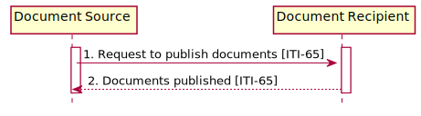

<!-- transaction-65.md 
*****************************************************************************************
*                            WARNING: DO NOT EDIT THIS FILE                             *
*                                                                                       *
* This file is generated by SUSHI. Any edits you make to this file will be overwritten. *
*                                                                                       *
* To change the contents of this file, edit the original source file at:                *
* ig-data/input/pagecontent/transaction-65.md                                           *
*****************************************************************************************
 -->
This section corresponds to transaction [ITI-65] of the IHE Technical Framework. Transaction [ITI-65] is used by the Document Source and Document Recipient Actors. The Provide Document Bundle [ITI-65] transaction is used to transmit a set of documents and associated metadata.

### Scope

The Provide Document Bundle [ITI-65] transaction passes a Provide Document Bundle Request from a Document Source to a Document Recipient.

### Actors Roles

<table border='1' borderspacing='0'>
<caption><b>Table: Actor Roles</b></caption>
<thead><tr><th>Actor</th><th>Role</th></tr></thead>
<tbody>
<tr><td><a href="actors_and_transactions.html#document-source">Document Source</a></td>
<td>Sends documents and metadata to the Document Recipient</td>
</tr>
<tr><td><a href="actors_and_transactions.html#document-recipient">Document Recipient</a></td>
<td>Accepts the document and metadata sent from the Document Source</td>
</tr>      
</tbody>
</table>

### Referenced Standards

<table border='1' borderspacing='0'>
<caption><b>Table: Referenced Standards</b></caption>
<thead><tr><th>Standard</th><th>Name</th></tr></thead>
<tbody>
<tr><td>FHIR-R4</td><td><a href='http://www.hl7.org/FHIR/R4'>HL7 FHIR Release 4.0</a></td></tr>
</tbody>
</table>

### Interactions
        

**Figure: Provide Document Bundle Interactions**

#### Provide Document Bundle Request Message
This message uses the HTTP POST method on the target Provide Document Bundle endpoint to convey the metadata and the document(s) as a FHIR transaction.

##### Trigger Events

This method is invoked when the Document Source needs to submit one or more documents to a Document Recipient. 

##### Message Semantics

The Document Source shall initiate a FHIR “transaction” using a “create” action by sending an HTTP POST request method composed of a FHIR Bundle Resource containing the DocumentManifest Resource, one or more DocumentReference Resources, zero or more List Resources, and zero or more Binary Resources to the Document Recipient. Refer to ITI TF-3: 4.5.1 for details on the FHIR Resources and how Document Sharing metadata attributes are mapped. 

The media type of the HTTP body shall be either application/fhir+json or application/fhir+xml.

See http://hl7.org/fhir/R4/http.html#transaction for complete requirements of a transaction. See http://hl7.org/fhir/R4/bundle-transaction.html for example of a transaction bundle.

The Provide Document Bundle message is sent to the base URL as defined in FHIR. See http://hl7.org/fhir/R4/http.html for the definition of “HTTP” access methods and “base”.

The Document Source shall assure all FHIR resource elements are consistent with the Document Sharing metadata requirements as specified for attributes ITI TF-3: Table 4.3.1-3 “Sending Actor Metadata Attribute Optionality”. The Document Source that supports the “Comprehensive Metadata” or the “XDS on FHIR” Options shall assure consistency with column “XDS DS”; otherwise, the Document Source shall assure consistency with column “XDR MS”. The Document Source shall not provide any entryUUID values.

###### Bundle Resources

For complete information on constructing a FHIR Bundle Resource, see http://hl7.org/fhir/R4/bundle.html

The FHIR Bundle.meta.profile shall have the following value depending on the use of Comprehensive metadata or Minimal metadata:. 
* Comprehensive Metadata: http://ihe.net/fhir/StructureDefinition/IHE_MHD_Provide_Comprehensive_DocumentBundle
* Minimal Metadata: http://ihe.net/fhir/StructureDefinition/IHE_MHD_Provide_Minimal_DocumentBundle

All resources that are indicated as ‘contained’ in ITI TF-3: 4.5.1 shall be contained using the FHIR contained method (see http://hl7.org/fhir/R4/references.html#contained).

When the DocumentReference.content.attachment.url points at a Binary Resource, the Binary Resource shall be in the Bundle. See FHIR Resolving references in Bundles at http://hl7.org/fhir/R4/bundle.html#references.

###### Patient Identity

All DocumentReference.subject, List.subject, and DocumentManifest.subject values shall be References to a FHIR Patient Resource identified by an absolute external reference (URL). This value may be obtained through use of PDQm or PIXm, or by some other means. The Patient Resource needs to be accessible to both the Document Source and the Document Recipient.

When sourcePatientInfo is provided, the DocumentReference.context.sourcePatientInfo shall be a reference to a “contained” Patient Resource. That is, the source patient info is encoded in a Patient Resource within the DocumentReference.contained element (see http://hl7.org/fhir/R4/references.html#contained).

###### Replace, Transform, Signs, and Append Associations

The DocumentReference.relatesTo element indicates an association between DocumentReference resources. The relatesTo.target element in the provided DocumentReference points at the pre-existing DocumentReference that is being replaced, transformed, signed, or appended. The relatesTo.code element in the provided DocumentReference shall be the appropriate relationship type code defined in http://hl7.org/fhir/R4/valueset-document-relationship-type.html. 

##### Expected Actions

The Document Recipient shall accept both media types `application/fhir+json` and `application/fhir+xml`.

On receipt of the submission, the Document Recipient shall validate the resources and respond with one of the HTTP codes defined in Section 3.65.4.2.2 Message Semantics. 

The Document Recipient shall process the bundle atomically, analogous to both the Provide and Register Document Set-b [ITI-41] transaction and FHIR “transaction” as specified in http://hl7.org/fhir/R4/http.html#transaction . 

The Document Recipient shall validate the bundle first against the FHIR specification. Guidance on what FHIR considers a valid Resource can be found at http://hl7.org/fhir/R4/validation.html. 

The Document Recipient shall verify the FHIR resource elements for consistency with the Document Sharing metadata requirements as specified for attributes ITI TF-3: Table 4.3.1-3: “Sending Actor Metadata Attribute Optionality”. The Document Recipient that supports the “Comprehensive Metadata” or the “XDS on FHIR” Option shall validate against column “XDS DS”; otherwise the Document Recipient shall validate against column “XDR MS”. 

If necessary for processing, the Document Recipient shall retrieve Resources referenced by absolute URLs in the FHIR Bundle Resource.

If the Document Recipient encounters any errors or if any validation fails, the Document Recipient shall return an error, as documented in Section 3.65.4.2.2. If appropriate, it shall use error codes from ITI TF-3: Table 4.2.4.1-2.

If the Provide Document Bundle Message contains a DocumentReference Resource with a relatesTo element and the Document Recipient does not support the relatesTo.code value, it shall return a warning message, as indicated in Table 3.65.4.1.3-1.

Table 3.65.4.1.3-1: Warning message when relatesTo code is not supported

|relatesTo.code |	Warning |
|---------------|-----------|
|replaces	 | PartialReplaceContentNotProcessed |
|transforms	 | PartialTransformContentNotProcessed |
|appends	 | PartialAppendContentNotProcessed |

If the Provide Document Bundle Message contains a List Resource and the Document Recipient does not support the List Resource (aka, Folders), the Document Recipient shall either fail the whole transaction or may ignore the List, continuing processing of the transaction, and return a “PartialFolderContentNotProcessed” warning. 

###### XDS on FHIR Option

The MHD Document Recipient is grouped with an XDS Document Source when it supports the “XDS on FHIR” Option. The Document Recipient shall transform the Bundle content into a proper message for the Provide and Register Document Set-b [ITI-41] transaction. The Document Recipient shall create appropriate metadata from Resources in the FHIR Bundle Resource, including SubmissionSet, DocumentEntry, and Associations. 

If the Provide Document Bundle Message contains a DocumentReference with a relatesTo element that has a code equal to "replaces" (as defined in http://hl7.org/fhir/R4/valueset-document-relationship-type.html), the XDS Document Source shall include a corresponding RPLC Association in the Submission Set for the Provide and Register Document Set-b [ITI-41] transaction. 

If the Provide Document Bundle Message contains a DocumentReference with a relatesTo element that has a code equal to "transforms", the XDS Document Source shall include a corresponding XFRM Association in the Submission Set for the Provide and Register Document Set-b [ITI-41] transaction. 

If the Provide Document Bundle Message contains a DocumentReference with a relatesTo element that has a code equal to "appends", the XDS Document Source shall include a corresponding APND Association in the Submission Set for the Provide and Register Document Set-b [ITI-41] transaction.

The Document Recipient shall map List Resources in the Bundle Resource to XDS Folders, as specified in [ITI TF-3: Table 4.5.1.1-1](metadata_maps.html#folder).

Some FHIR elements do not translate to XDS concepts; the handling of these elements is left to the implementer of the Document Recipient. 

Upon successful conversion of the FHIR Bundle to XDS Document Sharing metadata, the grouped Document Source shall execute the Provide and Register Document Set-b [ITI-41] transaction. The transaction result, and any error or warning messages, shall be reported to the MHD Document Source. The Document Recipient is responsible for translating the XDS response to the appropriate HTTP Status Code and FHIR OperationOutcome Resource in the Provide Document Bundle Response Message.

#### Provide Document Bundle Response Message

The Document Recipient returns a HTTP Status code appropriate to the processing outcome, conforming to the transaction specification requirements as specified in http://hl7.org/fhir/R4/http.html#transaction 

##### Trigger Events

This message shall be sent when a success or error condition needs to be communicated. Success is only indicated once the document(s) is/are received and completely processed and persisted as appropriate to the Document Recipient Actor configuration. 

##### Message Semantics

To enable the Document Source to know the outcome of processing the transaction, and the identities assigned to the resources by the Document Recipient, the Document Recipient shall return a Bundle, with type set to transaction-response, that contains one entry for each entry in the request, in the same order as received, with the Bundle.entry.response.outcome indicating the results of processing the entry (such as a PartialFolderContentNotProcessed warning). The Document Recipient shall comply with FHIR http://hl7.org/fhir/R4/bundle.html#transaction-response and http://hl7.org/fhir/R4/http.html#transaction-response. 

To indicate success the overall http 200 response is used. The Bundle.entry.response.status shall be “201” to indicate the Resource has been created; the .location element shall be populated, and the .etag element may be populated when the Document Recipient supports FHIR resource versioning.

##### Expected Actions

If the Document Recipient returns an HTTP redirect response (HTTP status codes 301, 302, 303, or 307), the Document Source shall follow the redirect, but may stop processing if it detects a loop. See RFC7231 Section 6.4 Redirection 3xx.

The Document Source processes the results according to application-defined rules.	

#### CapabilityStatement Resource

Document Recipient implementing this transaction shall provide a CapabilityStatement Resource as described in [ITI TF-2x: Appendix Z.3](appendix_z.html#capability) indicating the transaction has been implemented. 
* Requirements CapabilityStatement for [Document Source](IHE.MHD.DocumentSource.html)
* Requirements CapabilityStatement for [Document Recipient](IHE.MHD.DocumentRecipient.html)

### Security Considerations

See [MHD Security Considerations](security_considerations.html)

#### Security Audit Considerations

The security audit criteria are similar to those for the Provide and Register Document Set-b [ITI-41] transaction as this transaction does export a document. Grouping a Document Source or Document Recipient with an ATNA Secure Node or Secure Application is recommended, but not mandated. 

##### Document Source Audit 

The Document Source when grouped with ATNA Secure Node or Secure Application actor shall be able to record a [Provide Audit Bundle Source Audit Event Log](IHE.MHD.ProvideBundle.Audit.Source.html). [Audit Example for a Provide Bundle Transaction from source perspective](ex-auditProvideBundle-source.html) 

##### Document Recipient Audit 

The Document Recipient when grouped with ATNA Secure Node or Secure Application actor shall be able to record a [Provide Audit Bundle Recipient Audit Event Log](IHE.MHD.ProvideBundle.Audit.Recipient.html). [Audit Example for a Provide Bundle Transaction from recipient perspective](ex-auditProvideBundle-dest.html) 
