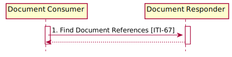

<!-- transaction-67.md 
*****************************************************************************************
*                            WARNING: DO NOT EDIT THIS FILE                             *
*                                                                                       *
* This file is generated by SUSHI. Any edits you make to this file will be overwritten. *
*                                                                                       *
* To change the contents of this file, edit the original source file at:                *
* ig-data/input/pagecontent/transaction-67.md                                           *
*****************************************************************************************
 -->
This section corresponds to transaction [ITI-67] of the IHE Technical Framework. Transaction [ITI-67] is used by the Document Consumer and Document Responder Actors.

### Scope

The Find Document References transaction is used to find DocumentReference Resources that satisfy a set of parameters. It is equivalent to the FindDocuments and FindDocumentsByReferenceId queries from the Registry Stored Query [ITI-18] transaction. The result of the query is a FHIR Bundle containing DocumentReference Resources that match the query parameters.

### Actors Roles

<table border='1' borderspacing='0'>
<caption><b>Table: Actor Roles</b></caption>
<thead><tr><th>Actor</th><th>Role</th></tr></thead>
<tbody><tr><td><a href="actors_and_transactions.html#document-consumer">Document Consumer</a></td>
<td>Requests a list of DocumentReference Resources, matching the supplied set of criteria, from the Document Responder</td>
</tr>
<tr><td><a href="actors_and_transactions.html#document-responder">Document Responder</a></td>
<td>Returns DocumentReference Resources that match the search criteria provided by the Document Consumer</td>
</tr>
</tbody>
</table>


### Referenced Standards

<table border='1' borderspacing='0'>
<caption><b>Table 3.71.3-1: Referenced Standards</b></caption>
<thead><tr><th>Standard</th><th>Name</th></tr></thead>
<tbody>
<tr><td>FHIR-R4</td><td><a href='http://www.hl7.org/FHIR/R4'>HL7 FHIR Release 4.0</a></td></tr>
</tbody>
</table>

### Interactions
        


<div style="clear: left"/>

**Figure: Find Document References Interactions**

#### Find Document References Request message

This message uses the HTTP GET method parameterized query to obtain DocumentReference Resources from the Document Responder. 

##### Trigger Events

When the Document Consumer needs to discover DocumentReference Resources matching various metadata parameters, it issues a Find Document References message. 

##### Message Semantics

The Document Consumer executes an HTTP GET against the Document Responder’s DocumentReference URL. The search target follows the FHIR HTTP specification, addressing the DocumentReference Resource http://hl7.org/fhir/R4/http.html:
```
[base]/DocumentReference?<query>
```
This URL is configurable by the Document Responder and is subject to the following constraints: 

The <query> represents a series of encoded name-value pairs representing the filter for the query, as specified in Section 3.67.4.1.2.1, as well as control parameters to modify the behavior of the Document Responder such as response format, or pagination.

###### Query Search Parameters

The Document Consumer may supply, and the Document Responder shall be capable of processing, all query parameters listed below. All query parameter values shall be appropriately encoded per RFC3986 “percent” encoding rules. Note that percent encoding does restrict the character set to a subset of ASCII characters which is used for encoding all other characters used in the URL.

The Document Consumer shall include search parameter patient or patient.identifier, and status. The other parameters described below are optional. The Document Responder must implement the parameters described below. The Document Responder may choose to support additional query parameters beyond the subset listed below. Any additional query parameters supported shall be supported according to the core FHIR specification. Such additional parameters are considered out of scope for this transaction. Any additional parameters not supported should be ignored. See http://hl7.org/fhir/R4/search.html#errors. 

**patient** 
:This parameter is of type Reference(Patient). The Document Consumer may get this reference using the PDQm or PIXm Profile. When the patient parameter is used, the Patient reference would need to be accessible to both the Document Consumer and the Document Responder.

**patient.identifier** 
:This parameter, of type token, specifies an identifier associated with the patient to which the DocumentReference Resource is assigned.  See ITI TF-2x: Appendix Z.2.2 for additional constraints on the use of the token search parameter type. 

**status** 
:This parameter, of type token, specifies the status of the DocumentReference Resource, or in Document Sharing nomenclature, the availabilityStatus of the Document Entry. The Document Consumer shall populate the identifier portion of the token using one of the short codes in Table 3.67.4.1.2.1-1. The system portion of the token shall not be populated.

**identifier** 
:This parameter, of type token, specifies an identifier for this DocumentReference and/or the contained document. The search results represent the results of a search on DocumentReference.masterIdentifier and DocumentReference.identifier. See ITI TF-2x: Appendix Z.2.2 for additional constraints on the use of the token search parameter type. 

**date**
:This parameter, of type date, specifies the time when the document was created. Note: The DocumentReference Resource does not yet have a query parameter for creationTime of the document; it has only a date element which is the creation date/time of the DocumentReference. For FHIR R4 we align these two elements so that query will function. See FHIR http://hl7.org/fhir/R4/search.html#date for use of the date search type.

**author.given** and **author.family** 
:These parameters, of type string, specify the name parts of the author person which is associated with the DocumentReference Resource, or in Document Sharing nomenclature, the author of the Document Entry. See ITI TF-2x: Appendix Z.2.3 for use of the string data type. 

**category** 
:This parameter, of type token, specifies the general classification of the DocumentReference Resource, or in Document Sharing nomenclature, the classCode of the Document Entry. See ITI TF-2x: Appendix Z.2.2 for additional constraints on the use of the token search parameter type.

**type** 
:This parameter, of type token, specifies the specific type of the DocumentReference resource or in Document Sharing nomenclature, the typeCode of the Document Entry. See ITI TF-2x: Appendix Z.2 for additional constraints on the use of the token search parameter type.

**setting** 
:This parameter, of type token, specifies the specific practice setting of the DocumentReference Resource, or in Document Sharing nomenclature, the practiceSettingCode of the Document Entry. See ITI TF-2x: Appendix Z.2 for additional constraints on the use of the token search parameter type.

**period** 
:This parameter, of type date, represents the time of service that is being documented by the DocumentReference. The period search parameter specifies an interval which the time of service overlaps. In Document Sharing nomenclature, this query parameter represents from/to parameters for the serviceStartTime and serviceStopTime of the Document Entry. See FHIR http://hl7.org/fhir/R4/search.html#date for use of the date search type.

**facility** 
:This parameter, of type token, specifies the kind of facility found in DocumentReference.context.facilityType, or in Document Sharing nomenclature, the healthcareFacilityTypeCode of the Document Entry. See ITI TF-2x: Appendix Z.2.2 for additional constraints on the use of the token search parameter type.

**event**  
:This parameter, of type token, specifies the main clinical acts documented by the DocumentReference Resource, or in Document Sharing nomenclature, the eventCodeList of the Document Entry. See ITI TF-2x: Appendix Z.2.2 for additional constraints on the use of the token search parameter type.

**security-label** 
:This parameter, of type token, specifies the security labels of the document referenced by DocumentReference Resource, or in Document Sharing nomenclature, the confidentialityCode of the Document Entry. See ITI TF-2x: Appendix Z.2.2 for additional constraints on the use of the token search parameter type.

**format** 
:This parameter, of type token, specifies the format of the DocumentReference Resource, or in Document Sharing nomenclature, the formatCode of the Document Entry. See ITI TF-2x: Appendix Z.2.2 for additional constraints on the use of the token search parameter type.

**related**
:This parameter, of type reference, represents other identifiers associated with the DocumentReference Resource, or in Document Sharing nomenclature, the referenceIdList of the Document Entry. 


###### Populating Expected Response Format

The FHIR standard provides encodings for responses as either XML or JSON. The Document Responder shall support both message encodings, whilst the Document Consumer shall support one and may support both.

See ITI TF-2x: Appendix Z.6 for details. 

##### Expected Actions

The Document Responder shall process the query to discover the DocumentReference entries that match the search parameters given. 

###### XDS on FHIR Option

The Document Responder is grouped with an XDS Document Consumer when it supports the “XDS on FHIR” Option. The Document Responder shall map the query parameters as listed in Table 3.67.4.1.3-1 and shall execute a Registry Stored Query [ITI-18] for FindDocuments or FindDocumentsByReferenceIdList (see ITI TF-2a: 3.18.4.1.2.3.7.1 and 3.18.4.1.2.3.7.14). All of the query parameters in Table 3.67.4.1.3-1 shall be supported by the Document Responder. No additional query parameters as defined in FHIR are required of the Document Responder, but they may be offered.

**Table 3.67.4.1.3-1: ITI-18 FindDocuments Query Parameter Mapping**

| ITI-67 Parameter Name	| ITI-18 Parameter Name |
|-----------|-----------|
| patient or patient.identifier	| $XDSDocumentEntryPatientId |
| date Note 1 Note 5	| $XDSDocumentEntryCreationTimeFrom |
| date Note 2 Note 5	| $XDSDocumentEntryCreationTimeTo |
| author.given / author.family	| $XDSDocumentEntryAuthorPerson |
| status	| $XDSDocumentEntryStatus |
| (Not supported) Note 3	| $XDSDocumentEntryType |
| category	| $XDSDocumentEntryClassCode |
| type	| $XDSDocumentEntryTypeCode |
| setting	| $XDSDocumentEntryPracticeSettingCode |
| period Note 1	| $XDSDocumentEntryServiceStartTimeFrom |
| period Note 2	| $XDSDocumentEntryServiceStartTimeTo |
| period Note 1	| $XDSDocumentEntryServiceStopTimeFrom |
| period Note 2	| $XDSDocumentEntryServiceStopTimeTo |
| facility	| $XDSDocumentEntryHealthcareFacilityTypeCode |
| event	| $XDSDocumentEntryEventCodeList |
| security-label	| $XDSDocumentEntryConfidentialityCode |
| format	| $XDSDocumentEntryFormatCode |
| related Note 4	| $XDSDocumentEntryReferenceIdList |

Note 1: This FindDocuments parameter is used when the greater than parameter modifier is used on the indexed parameter. 

Note 2: This FindDocuments parameter is used when the less than parameter modifier is used on the indexed parameter. 

Note 3: The $XDSDocumentEntryType is not a supported query parameter in HL7 FHIR.

Note 4: The $XDSDocumentEntryReferenceIdList can only be mapped when using the XDS FindDocumentsByReferenceId query.

Note 5: The FHIR DocumentReference does not yet have a query parameter for creationTime of the document, it has only a date element which is the creation date/time of the DocumentReference. For FHIR R4 we align these two elements so that query will function.

**Table 3.67.4.1.2.1-1: Values for code for status of DocumentReference**

|FHIR Code	|ebRIM Code |
|-----------|-----------|
|current	|urn:oasis:names:tc:ebxml-regrep:StatusType:Approved |
|superseded	|urn:oasis:names:tc:ebxml-regrep:StatusType:Deprecated |


#### Find Document References Response message

The Document Responder returns a HTTP Status code appropriate to the processing as well as a Bundle of the matching DocumentReference Resources.

##### Trigger Events

The Document Responder completed processing of the Find Document Reference Request message. 

##### Message Semantics

Based on the query results, the Document Responder will either return an error or success. Guidance on handling Access Denied related to use of 200, 403 and 404 can be found in ITI TF-2x: Appendix Z.7. 

When the Document Responder needs to report an error, it shall use HTTP error response codes and should include a FHIR OperationOutcome with more details on the failure. See FHIR http://hl7.org/fhir/R4/http.html and http://hl7.org/fhir/R4/operationoutcome.html.

If the Find Document References message is processed successfully, whether or not any DocumentReference Resources are found, the HTTP status code shall be 200. The Find Document References Response message shall be a Bundle Resource containing zero or more DocumentReference Resources. If the Document Responder is sending warnings, the Bundle Resource shall also contain an OperationOutcome Resource that contains those warnings.

The response shall adhere to the FHIR Bundle constraints specified in ITI TF-2x: Appendix Z.1. 

###### DocumentReference Resource Contents

The DocumentReference Resources returned shall be compliant with the FHIR specification http://hl7.org/fhir/R4/documentreference.html

The DocumentReference Resources returned will be compliant with ITI TF-3: 4.5.1.1 for the IHE restrictions on DocumentReference Resource and for a mapping from IHE Document Sharing profiles (e.g., XDS) to FHIR. Document Consumers should be robust to receiving DocumentReference Resources that are not IHE compliant.

###### Resource Bundling

Resource Bundling shall comply with the guidelines in ITI TF-2x: Appendix Z.1. 

**Document location**

The Document Responder shall place into the DocumentReference.content.attachment.url element a full URL that can be used by the Document Consumer to retrieve the document using the Retrieve Document [ITI-68] transaction. IHE does not specify the format of the URL. There are many ways to encode this URL that allow for easy processing on a Retrieve Document transaction. Some examples are to encode homeCommunityId, repositoryUniqueId, uniqueId, and patientId into the URL. This could be done in many ways including using character separators or directory separators. In this way, the Document Responder can support many communities, and/or many repositories. 

##### Expected Actions

If the Document Responder returns an HTTP redirect response (HTTP status codes 301, 302, 303, or 307), the Document Consumer shall follow the redirect, but may stop processing if it detects a loop. See RFC7231 Section 6.4 Redirection 3xx.

The Document Consumer shall process the results according to application-defined rules. The Document Consumer should be robust as the response may contain DocumentReference Resources that match the query parameters but are not compliant with the DocumentReference constraints defined in ITI TF-3: 4.5.

#### CapabilityStatement Resource

Document Responders implementing this transaction shall provide a CapabilityStatement Resource as described in [ITI TF-2x: Appendix Z.3](appendix_z.html#capability) indicating the transaction has been implemented. 
* Requirements CapabilityStatement for [Document Consumer](IHE.MHD.DocumentConsumer.html)
* Requirements CapabilityStatement for [Document Responder](IHE.MHD.DocumentResponder.html)

### Security Considerations

See [MHD Security Considerations](security_considerations.html)

This transaction should not return information that the Document Consumer is not authorized to access. Where authorization here is inclusive of system, app, and user according to local policy, patient consents, and security layering. However, the transaction may return DocumentReference resources that have Reference elements that the Document Consumer may not have access to. This is to say that the authorization need only be to the content returned in the Bundle. There may be references (URLs) for which the content is not authorized. This is considered proper as the Document Consumer would need to retrieve the content pointed to by those references, and at that time the proper authorization decision would be made on that context and content. In this way it is possible for a Document Consumer to get DocumentManifest resources that are pointing at data that the Document Consumer is not authorized to retrieve. Thus, the URLs used must be carefully crafted so as to not expose sensitive data in the URL value.

Given that the Document Responder is responsible for the URL placed into DocumentReference.content.attachment.url, care must be taken to assure that manipulation of this URL prior to a Retrieve Document transaction does not expose resources the Document Consumer should not have access to.

#### Security Audit Considerations

The security audit criteria are similar to those for the Registry Stored Query [ITI-18] transaction. Grouping a Document Consumer or Document Responder with an ATNA Secure Node or Secure Application is recommended, but not mandated. 

##### Document Consumer Audit

The Document Consumer when grouped with ATNA Secure Node or Secure Application actor shall be able to record a [Find Document References Consumer Audit Event Log](IHE.MHD.FindDocRefs.Audit.Consumer.html). [Audit Example for a Find Document References transaction from consumer perspective](ex-auditFindDocRefs-consumer.html) 

##### Document Responder Audit

The Document Responder when grouped with ATNA Secure Node or Secure Application actor shall be able to record a [Find Document References Responder Audit Event Log](IHE.MHD.FindDocRefs.Audit.Responder.html). [Audit Example for a Find Documet Lists Transaction from responder perspective](ex-auditProvideBundle-responder.html) 