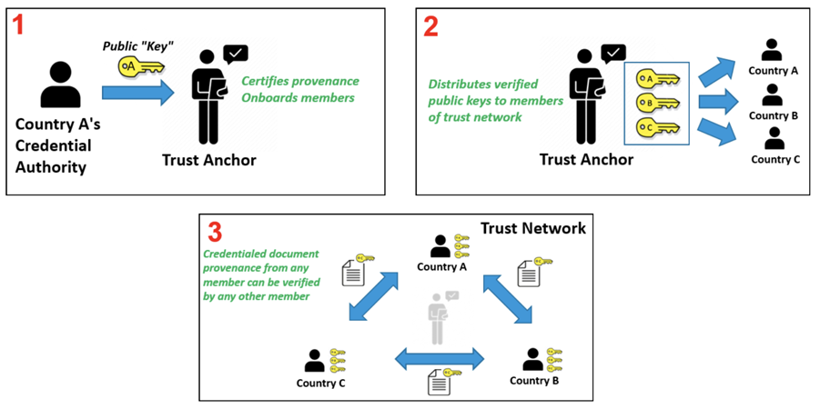

# WHO GDHCN Trust Establishment - Verifiable Health Links v1.0.0-comment

* [**Table of Contents**](toc.md)
* [**Artifacts Summary**](artifacts.md)
* **WHO GDHCN Trust Establishment**

## WHO GDHCN Trust Establishment 

| | |
| :--- | :--- |
| *Official URL*:https://profiles.ihe.net/ITI/VHL/ExampleScenario/UseCaseGDHCN | *Version*:1.0.0-comment |
| Active as of 2026-06-14 | *Computable Name*:GDHCN |

The World Health Organization (WHO) operates the [Global Digital Health Certification Network (GDHCN)](https://smart.who.int/trust), a trust network for public-sector health jurisdictions. The GDHCN provides the infrastructure for the bilateral verification and utilization of Verifiable Digital Health Certificates across participating jurisdictions.

The GDHCN uses the notion of a **Trust Domain** which is defined by a set of:

* use cases and business processes related to the utilization of Verifiable Digital Health Certificates
* open, interoperable technical specifications that define the applicable Trusted Services and verifiable digital health certificates for the use case
* policy and regulatory standards describing expected behavior of participants for the use case

**How Trust is Established:**

Trust in the GDHCN is established through a Public Key Infrastructure (PKI). Each participating jurisdiction submits its PKI material — including Signing Certificate Authority (SCA) certificates and Document Signer Certificates (DSCs) — to the WHO Trust Anchor through a formal onboarding process. The Trust Anchor publishes this key material in trust lists that other participants can retrieve and use to verify the digital signatures on health certificates.

**DID-Based Trust List Distribution:**

The GDHCN distributes trust lists using [Decentralized Identifiers (DIDs)](https://www.w3.org/TR/did-core/). Each participating jurisdiction's key material is represented as a DID Document containing verification methods with the jurisdiction's public keys. These DID Documents are published as endpoints by the Trust Anchor, analogous to how the [IHE mCSD Profile](https://profiles.ihe.net/ITI/mCSD/) distributes service endpoints for Organizations. This enables participants to discover and retrieve the PKI material needed for signature verification through a standardized, cacheable, and federated mechanism.

**Trust Network Gateway:**

The GDHCN Trust Network Gateway (TNG) provides a federated architecture that enables multiple trust anchors and cross-gateway trust propagation. The TNG supports both an API gateway method and DID-based resolution for trust list distribution, ensuring interoperability across diverse jurisdictional implementations.

The PKI operated by the WHO supports a variety of trust domains, two of which — the Hajj Pilgrimage and the Pan-American Highway for Health — are described below.



**Pre-conditions:**

Jurisdiction has completed the GDHCN onboarding process and has generated SCA and DSC certificates.

**Post-conditions:**

Jurisdiction's PKI material is published in the GDHCN trust list and available for retrieval by other participants.


## Resource Content

```json
{
  "resourceType" : "ExampleScenario",
  "id" : "UseCaseGDHCN",
  "url" : "https://profiles.ihe.net/ITI/VHL/ExampleScenario/UseCaseGDHCN",
  "version" : "1.0.0-comment",
  "name" : "GDHCN",
  "status" : "active",
  "date" : "2026-06-14T15:36:12-05:00",
  "publisher" : "IHE IT Infrastructure Technical Committee",
  "contact" : [{
    "telecom" : [{
      "system" : "url",
      "value" : "https://www.ihe.net/ihe_domains/it_infrastructure/"
    }]
  },
  {
    "telecom" : [{
      "system" : "email",
      "value" : "iti@ihe.net"
    }]
  },
  {
    "name" : "IHE IT Infrastructure Technical Committee",
    "telecom" : [{
      "system" : "email",
      "value" : "iti@ihe.net"
    }]
  }],
  "jurisdiction" : [{
    "coding" : [{
      "system" : "http://unstats.un.org/unsd/methods/m49/m49.htm",
      "code" : "001"
    }]
  }],
  "purpose" : "The World Health Organization (WHO) operates the [Global Digital Health Certification Network (GDHCN)](https://smart.who.int/trust), a trust network for public-sector health jurisdictions. The GDHCN provides the infrastructure for the bilateral verification and utilization of Verifiable Digital Health Certificates across participating jurisdictions.\n\nThe GDHCN uses the notion of a **Trust Domain** which is defined by a set of:\n- use cases and business processes related to the utilization of Verifiable Digital Health Certificates\n- open, interoperable technical specifications that define the applicable Trusted Services and verifiable digital health certificates for the use case\n- policy and regulatory standards describing expected behavior of participants for the use case\n\n**How Trust is Established:**\n\nTrust in the GDHCN is established through a Public Key Infrastructure (PKI). Each participating jurisdiction submits its PKI material — including Signing Certificate Authority (SCA) certificates and Document Signer Certificates (DSCs) — to the WHO Trust Anchor through a formal onboarding process. The Trust Anchor publishes this key material in trust lists that other participants can retrieve and use to verify the digital signatures on health certificates.\n\n\n**DID-Based Trust List Distribution:**\n\nThe GDHCN distributes trust lists using [Decentralized Identifiers (DIDs)](https://www.w3.org/TR/did-core/). Each participating jurisdiction's key material is represented as a DID Document containing verification methods with the jurisdiction's public keys. These DID Documents are published as endpoints by the Trust Anchor, analogous to how the [IHE mCSD Profile](https://profiles.ihe.net/ITI/mCSD/) distributes service endpoints for Organizations. This enables participants to discover and retrieve the PKI material needed for signature verification through a standardized, cacheable, and federated mechanism.\n\n**Trust Network Gateway:**\n\nThe GDHCN Trust Network Gateway (TNG) provides a federated architecture that enables multiple trust anchors and cross-gateway trust propagation. The TNG supports both an API gateway method and DID-based resolution for trust list distribution, ensuring interoperability across diverse jurisdictional implementations.\n\nThe PKI operated by the WHO supports a variety of trust domains, two of which — the Hajj Pilgrimage and the Pan-American Highway for Health — are described below.\n\n",
  "actor" : [{
    "actorId" : "jurisdiction",
    "type" : "entity",
    "name" : "Participating Jurisdiction",
    "description" : "A health jurisdiction participating in the GDHCN trust network, acting as a VHL Sharer or VHL Receiver."
  },
  {
    "actorId" : "trust-anchor",
    "type" : "entity",
    "name" : "WHO Trust Anchor",
    "description" : "The WHO Trust Anchor that validates, publishes, and distributes PKI material for the GDHCN trust network."
  }],
  "process" : [{
    "title" : "GDHCN Trust Establishment",
    "description" : "Process for establishing trust within the WHO GDHCN trust network through PKI material submission and trust list distribution.\n\n**Step 1: Jurisdiction Onboarding** — A participating jurisdiction completes the GDHCN onboarding process and submits its Signing Certificate Authority (SCA) and Document Signer Certificates (DSCs) to the WHO Trust Anchor. The Trust Anchor validates the submitted certificates and onboards the jurisdiction into the trust network.\n\n**Step 2: Trust List Publication** — The WHO Trust Anchor publishes the jurisdiction's PKI material as DID Documents in the GDHCN trust list. Each DID Document contains verification methods with the jurisdiction's public keys, distributed as endpoints that can be discovered and retrieved by other trust network participants.\n\n**Step 3: Trust List Retrieval** — Participating jurisdictions (acting as VHL Sharers or VHL Receivers) retrieve the trust list from the Trust Anchor. The retrieved DID Documents provide the public keys needed to verify digital signatures on health certificates and to establish secure channels for document exchange.",
    "preConditions" : "Jurisdiction has completed the GDHCN onboarding process and has generated SCA and DSC certificates.",
    "postConditions" : "Jurisdiction's PKI material is published in the GDHCN trust list and available for retrieval by other participants."
  }]
}

```
