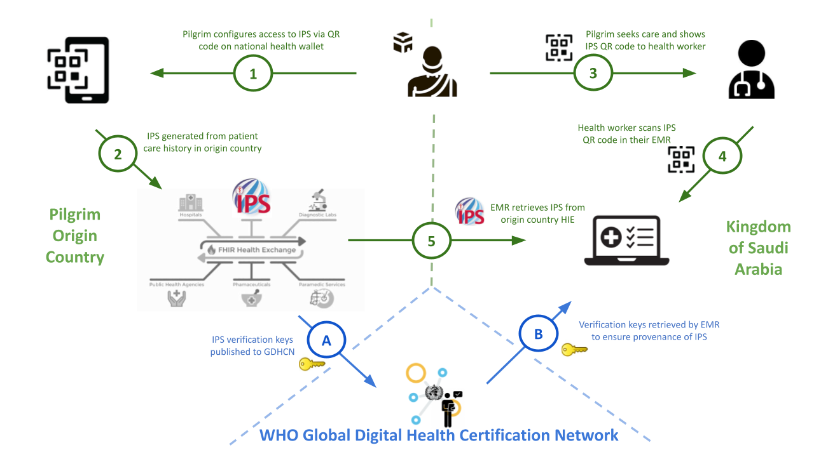

# Hajj Pilgrimage VHL Flow - Verifiable Health Links v1.0.0-comment

* [**Table of Contents**](toc.md)
* [**Artifacts Summary**](artifacts.md)
* **Hajj Pilgrimage VHL Flow**

## Hajj Pilgrimage VHL Flow 

| | |
| :--- | :--- |
| *Official URL*:https://profiles.ihe.net/ITI/VHL/ExampleScenario/UseCaseHajjPilgrimage | *Version*:1.0.0-comment |
| Active as of 2026-06-14 | *Computable Name*:HajjPilgrimage |

During the Hajj pilgrimage, the Kingdom of Saudi Arabia (KSA) hosts approximately two million pilgrims from across the globe as part of a mass gathering event. Temporary hospitals and clinics, comprising over a thousand beds, are established to provide care to the pilgrims over the four-week period of Hajj.

Starting with Hajj 1445 AH (2024 CE), pilgrims from Oman, Malaysia, and Indonesia were able to share their health records utilizing the International Patient Summary (IPS) with verification of health documents provided through the WHO Global Digital Health Certification Network (GDHCN) infrastructure.

Key Features:

* Trust established through WHO GDHCN trust network
* Multi-country interoperability (Oman, Malaysia, Indonesia to KSA)
* IPS-based continuity of care
* Consent captured and enforced through IPS Advanced Directives
* PIN protection for additional security on printed cards
* Support for both physical and digital VHL provisioning

Some of the challenges faced during the pilot implementation, though not necessarily to be taken up in this profile, include:

* while not the main point of security, leveraging the PIN is a weakness, need to enable better options for future consideration (e.g. biometrics, other authorization methods). The **Verifiable Credential Option** (ITI-YY5 Section 2:3.YY5.4.1.5) addresses this by allowing the VHL Receiver to authenticate using a self-issued VC signed with its trust network key, eliminating reliance on a shared PIN for receiver authentication while retaining the passcode as an optional additional factor for the holder.
* in planning for expansion to umrah and general tourism, there will not in general be a health check which presents some process challenges such as not having a encounter point to record consent prior to a visit
* how to scale and automate some of the health checks (e.g. are vaccinations sufficient) using verifiable health documents (e.g. the IPS).



**Pre-conditions:**

Pilgrim has received health assessment in home country. Home country has registered PKI material with WHO GDHCN Trust Anchor. Pilgrim has provided consent (verbal or digital) to share health records.

**Main Flow:**

1. **Pre-Departure Health Check**:Pilgrims begin their journey in their home country where they receive a health check and are educated on the use of QR codes (a version of Verifiable Health Links) and provide the consent to share their health records. This consent may be provided verbally or recorded digitally. When recorded, there are two notions of consent recorded:
* for their home country in which they agree that health records from their home country can be shared with appropriate authorities during Hajj
* for KSA is to permit utilization of these health records within the Saudi System. These consent records are recorded into the IPS Advanced Directives section and are included with the IPS when it is shared.

1. **VHL Generation**:The verifiable health link is provided by their home jurisdiction during their health check as a QR code. Depending on the digital infrastructure pilgrim's origin country, jurisdictional policies and digital capabilities (e.g. access to smart phones) of the pilgrim's origin country, the verifiable health link may be:
* generated and printed on the pilgrim's health card and distributed to the pilgrim at the time of the health check; or
* provisioned to the pilgrim through an existing digital health platform or wallet. For similar reasons, the verifiable health link may refer to:
* an instance of the IPS rendered as a PDF;
* an instance of the IPS rendered as JSON; or
* a folder containing at least the PDF of JSON rendering of the IPS as well associated digital signatures.

1. **VHL Provision During Care**:During a care encounter in KSA, the pilgrim provides their verifiable health link as a QR code to their care provider. Once a VHL is shared by a pilgrim during a care encounter in KSA:
* the VHL is verified through the GDHCN infrastructure
* an mTLS connection is established between the KSA EMRs and the origin country national infrastructure using key material exchanged via GDHCN
* a manifest of IPS related files including a PDF and JSON renderings and associated digital signatures
* The EMR retrieves the requisite files

**Post-conditions:**

KSA healthcare providers can access pilgrim health records as IPS.


## Resource Content

```json
{
  "resourceType" : "ExampleScenario",
  "id" : "UseCaseHajjPilgrimage",
  "url" : "https://profiles.ihe.net/ITI/VHL/ExampleScenario/UseCaseHajjPilgrimage",
  "version" : "1.0.0-comment",
  "name" : "HajjPilgrimage",
  "status" : "active",
  "date" : "2026-06-14T15:36:12-05:00",
  "publisher" : "IHE IT Infrastructure Technical Committee",
  "contact" : [{
    "telecom" : [{
      "system" : "url",
      "value" : "https://www.ihe.net/ihe_domains/it_infrastructure/"
    }]
  },
  {
    "telecom" : [{
      "system" : "email",
      "value" : "iti@ihe.net"
    }]
  },
  {
    "name" : "IHE IT Infrastructure Technical Committee",
    "telecom" : [{
      "system" : "email",
      "value" : "iti@ihe.net"
    }]
  }],
  "jurisdiction" : [{
    "coding" : [{
      "system" : "http://unstats.un.org/unsd/methods/m49/m49.htm",
      "code" : "001"
    }]
  }],
  "purpose" : "During the Hajj pilgrimage, the Kingdom of Saudi Arabia (KSA) hosts approximately two million pilgrims from across the globe as part of a mass gathering event. Temporary hospitals and clinics, comprising over a thousand beds, are established to provide care to the pilgrims over the four-week period of Hajj.\n\nStarting with Hajj 1445 AH (2024 CE), pilgrims from Oman, Malaysia, and Indonesia were able to share their health records utilizing the International Patient Summary (IPS) with verification of health documents provided through the WHO Global Digital Health Certification Network (GDHCN) infrastructure.\n\nKey Features:\n- Trust established through WHO GDHCN trust network\n- Multi-country interoperability (Oman, Malaysia, Indonesia to KSA)\n- IPS-based continuity of care\n- Consent captured and enforced through IPS Advanced Directives\n- PIN protection for additional security on printed cards\n- Support for both physical and digital VHL provisioning\n\nSome of the challenges faced during the pilot implementation, though not necessarily to be taken up in this profile, include:\n\n- while not the main point of security, leveraging the PIN is a weakness, need to enable better options for future consideration (e.g. biometrics, other authorization methods). The **Verifiable Credential Option** (ITI-YY5 Section 2:3.YY5.4.1.5) addresses this by allowing the VHL Receiver to authenticate using a self-issued VC signed with its trust network key, eliminating reliance on a shared PIN for receiver authentication while retaining the passcode as an optional additional factor for the holder.\n- in planning for expansion to umrah and general tourism, there will not in general be a health check which presents some process challenges such as not having a encounter point to record consent prior to a visit\n- how to scale and automate some of the health checks (e.g. are vaccinations sufficient) using verifiable health documents (e.g. the IPS).\n\n\n",
  "process" : [{
    "title" : "Hajj Pilgrimage VHL Flow",
    "description" : "Process for sharing pilgrim health records during Hajj using VHL with WHO GDHCN trust infrastructure for cross-border verification.",
    "preConditions" : "Pilgrim has received health assessment in home country. Home country has registered PKI material with WHO GDHCN Trust Anchor. Pilgrim has provided consent (verbal or digital) to share health records.",
    "postConditions" : "KSA healthcare providers can access pilgrim health records as IPS.",
    "step" : [{
      "operation" : {
        "number" : "1",
        "name" : "Pre-Departure Health Check",
        "description" : "Pilgrims begin their journey in their home country where they receive a health check and are educated on the use of QR codes (a version of Verifiable Health Links) and provide the consent to share their health records. This consent may be provided verbally or recorded digitally. When recorded, there are two notions of consent recorded:\r\n\r\n- for their home country in which they agree that health records from their home country can be shared with appropriate authorities during Hajj\r\n- for KSA is to permit utilization of these health records within the Saudi System. These consent records are recorded into the IPS Advanced Directives section and are included with the IPS when it is shared."
      }
    },
    {
      "operation" : {
        "number" : "2",
        "name" : "VHL Generation",
        "description" : "The verifiable health link is provided by their home jurisdiction during their health check as a QR code.\r\nDepending on the digital infrastructure pilgrim's origin country, jurisdictional policies and digital capabilities (e.g. access to smart phones) of the pilgrim's origin country, the verifiable health link may be:\r\n\r\n- generated and printed on the pilgrim's health card and distributed to the pilgrim at the time of the health check; or\r\n- provisioned to the pilgrim through an existing digital health platform or wallet. For similar reasons, the verifiable health link may refer to:\r\n- an instance of the IPS rendered as a PDF;\r\n- an instance of the IPS rendered as JSON; or\r\n- a folder containing at least the PDF of JSON rendering of the IPS as well associated digital signatures."
      }
    },
    {
      "operation" : {
        "number" : "3",
        "name" : "VHL Provision During Care",
        "description" : "During a care encounter in KSA, the pilgrim provides their verifiable health link as a QR code to their care provider. Once a VHL is shared by a pilgrim during a care encounter in KSA:\r\n\r\n- the VHL is verified through the GDHCN infrastructure\r\n- an mTLS connection is established between the KSA EMRs and the origin country national infrastructure using key material exchanged via GDHCN\r\n- a manifest of IPS related files including a PDF and JSON renderings and associated digital signatures\r\n- The EMR retrieves the requisite files"
      }
    }]
  }]
}

```
