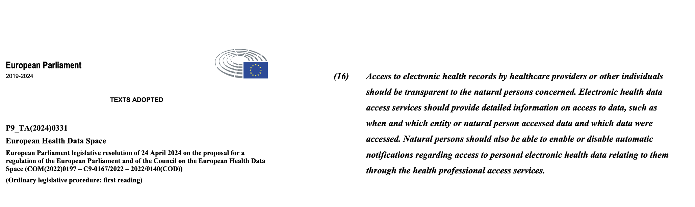

# European Vaccination Card (EVC) - Verifiable Health Links v1.0.0-comment

* [**Table of Contents**](toc.md)
* [**Artifacts Summary**](artifacts.md)
* **European Vaccination Card (EVC)**

## European Vaccination Card (EVC) 

| | |
| :--- | :--- |
| *Official URL*:https://profiles.ihe.net/ITI/VHL/ExampleScenario/UseCaseEVAC | *Version*:1.0.0-comment |
| Active as of 2026-06-14 | *Computable Name*:EUVAC |

The [European Vaccination Card (EVC)](https://euvabeco.eu/news/european-vaccination-card-evc-a-citizen-held-card-to-foster-informed-decision-making-on-vaccination-and-improve-continuity-of-care-across-the-eu/) is a citizen-held card to foster informed decision-making on vaccination, and improve continuity of care across the EU.

The EVC will allow "Member States to bilaterally verify the authenticity of digital records through an interoperable trust architecture. While similar to the EU Digital COVID Certificate in being a portable vaccination record, the EVC serves a different purpose. Unlike the certificate, which often fulfilled legal or health mandates, the EVC is specifically designed to empower individuals by granting them control over their vaccination information. This empowerment is crucial for ensuring continuity of care for those crossing borders or transitioning between healthcare systems."

The EVC will operate in the context of the European Health Data Spaces that requires detailed information on access the health data to be recorded.



For more information see Regulation (EU) 2025/327 of the European Parliament and of the Council of 11 February 2025 on the European Health Data Space and amending Directive 2011/24/EU and Regulation (EU) 2024/2847. Specifically:

* [ANNEX II - Essential requirements for the harmonised software components of EHR systems and for products for which interoperability with EHR systems has been claimed](https://eur-lex.europa.eu/eli/reg/2025/327/oj#anx_II)
* [Article 9 - Right to obtain information on accessing data](https://eur-lex.europa.eu/eli/reg/2025/327/oj#art_9)

A critical privacy requirement for the EVC is unlinkability: Article 5a(16) of [Regulation (EU) No 910/2014 as amended](https://eur-lex.europa.eu/legal-content/EN/TXT/?uri=CELEX%3A02014R0910-20241018) **Article 5a(16):** The technical framework of the European Digital Identity Wallet shall:

> (a) not allow providers of electronic attestations of attributes or any other party, after the issuance of the attestation of attributes, to obtain data that allows transactions or user behaviour to be tracked, linked or correlated, or knowledge of transactions or user behaviour to be otherwise obtained, unless explicitly authorised by the user;

> (b) enable privacy preserving techniques which ensure unlinkability, where the attestation of attributes does not require the identification of the user.

The **Verifiable Credential Option** (ITI-YY5 Section 2:3.YY5.4.1.5) is relevant to the EUVAC context: the self-issued VC binds each manifest request cryptographically to the receiver's identity and the specific decoded manifest, ensuring the VHL Sharer can authenticate the receiver without maintaining a persistent session or correlating requests across VHL presentations — supporting the unlinkability requirements above when combined with appropriate key management practices.


## Resource Content

```json
{
  "resourceType" : "ExampleScenario",
  "id" : "UseCaseEVAC",
  "url" : "https://profiles.ihe.net/ITI/VHL/ExampleScenario/UseCaseEVAC",
  "version" : "1.0.0-comment",
  "name" : "EUVAC",
  "status" : "active",
  "date" : "2026-06-14T15:37:09-05:00",
  "publisher" : "IHE IT Infrastructure Technical Committee",
  "contact" : [{
    "telecom" : [{
      "system" : "url",
      "value" : "https://www.ihe.net/ihe_domains/it_infrastructure/"
    }]
  },
  {
    "telecom" : [{
      "system" : "email",
      "value" : "iti@ihe.net"
    }]
  },
  {
    "name" : "IHE IT Infrastructure Technical Committee",
    "telecom" : [{
      "system" : "email",
      "value" : "iti@ihe.net"
    }]
  }],
  "jurisdiction" : [{
    "coding" : [{
      "system" : "http://unstats.un.org/unsd/methods/m49/m49.htm",
      "code" : "001"
    }]
  }],
  "purpose" : "The [European Vaccination Card (EVC)](https://euvabeco.eu/news/european-vaccination-card-evc-a-citizen-held-card-to-foster-informed-decision-making-on-vaccination-and-improve-continuity-of-care-across-the-eu/) is a citizen-held card to foster informed decision-making on vaccination, and improve continuity of care across the EU.\n\nThe EVC will allow \"Member States to bilaterally verify the authenticity of digital records through an interoperable trust architecture. While similar to the EU Digital COVID Certificate in being a portable vaccination record, the EVC serves a different purpose. Unlike the certificate, which often fulfilled legal or health mandates, the EVC is specifically designed to empower individuals by granting them control over their vaccination information. This empowerment is crucial for ensuring continuity of care for those crossing borders or transitioning between healthcare systems.\"\n\nThe EVC will operate in the context of the European Health Data Spaces that requires detailed information on access the health data to be recorded.\n\n\n\nFor more information see Regulation (EU) 2025/327 of the European Parliament and of the Council of 11 February 2025 on the European Health Data Space and amending Directive 2011/24/EU and Regulation (EU) 2024/2847. Specifically:\n* [ANNEX II - Essential requirements for the harmonised software components of EHR systems and for products for which interoperability with EHR systems has been claimed](https://eur-lex.europa.eu/eli/reg/2025/327/oj#anx_II)\n* [Article 9 - Right to obtain information on accessing data](https://eur-lex.europa.eu/eli/reg/2025/327/oj#art_9)\n\nA critical privacy requirement for the EVC is unlinkability: Article 5a(16) of [Regulation (EU) No 910/2014 as amended](https://eur-lex.europa.eu/legal-content/EN/TXT/?uri=CELEX%3A02014R0910-20241018) **Article 5a(16):** The technical framework of the European Digital Identity Wallet shall:\n\n> (a) not allow providers of electronic attestations of attributes or any other party, after the issuance of the attestation of attributes, to obtain data that allows transactions or user behaviour to be tracked, linked or correlated, or knowledge of transactions or user behaviour to be otherwise obtained, unless explicitly authorised by the user;\n\n> (b) enable privacy preserving techniques which ensure unlinkability, where the attestation of attributes does not require the identification of the user.\n\nThe **Verifiable Credential Option** (ITI-YY5 Section 2:3.YY5.4.1.5) is relevant to the EUVAC context: the self-issued VC binds each manifest request cryptographically to the receiver's identity and the specific decoded manifest, ensuring the VHL Sharer can authenticate the receiver without maintaining a persistent session or correlating requests across VHL presentations — supporting the unlinkability requirements above when combined with appropriate key management practices."
}

```
