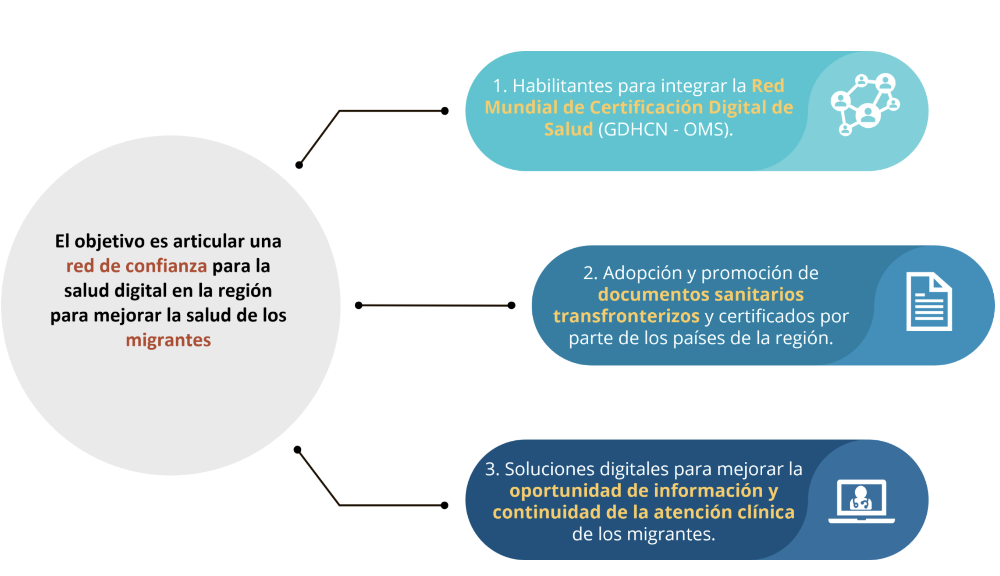

# Pan-American Highway for Health (PH4H) - Verifiable Health Links v1.0.0-comment

* [**Table of Contents**](toc.md)
* [**Artifacts Summary**](artifacts.md)
* **Pan-American Highway for Health (PH4H)**

## Pan-American Highway for Health (PH4H) 

| | |
| :--- | :--- |
| *Official URL*:https://profiles.ihe.net/ITI/VHL/ExampleScenario/UseCasePH4H | *Version*:1.0.0-comment |
| Active as of 2026-06-14 | *Computable Name*:PH4H |

In the region of the Americas, "countries identified several priorities for cross-border digital health, including optimizing available human resources through international telehealth, validating digital certificates, ensuring continuity of care, and regional resilience to face health emergencies by sharing data for public health. During the IDB-PAHO co-led event, RELACSIS 4.0.1 a plan was launched to strengthen regional digital health services and resilience, through regional data exchange and policy harmonization. Sixteen countries successfully exchanged digital vaccine certificates (COVID-19, Polio, Measles, and Yellow Fever) and critical clinical information (diagnosis, allergy, and prescription information) using international standards during the 2nd Regional LACPASS Connectathon.2 Regional bodies and network such as the Council of Ministers of Health of Central America and the Dominican Republic (COMISCA), The Caribbean Public Health Agency (CARPHA), and the LAC Digital Health Network (RACSEL) have all identified cross-border data sharing as a priority."
 [footnote](https://ewsdata.rightsindevelopment.org/files/documents/46/IADB-RG-T4546_BBZnmFh.pdf)

The Pan American Health Organization (PAHO) and the InterAmerican Development Bank (IADB) are supporting the development of policies and digital infrastructrue to support this need. One particular priority is to improve the continuity of care for internal migrants within the region, by ensuring individuals have access to and can share their vaccination records and the International Patient Summary.

The Pan-American Highway for Health (PH4H) "aims to provide patients with better healthcare services, regardless of their location. It will also enhance healthcare for those who move temporarily for work or study, as well as for migrants, by enabling them to share their health history, thus improving their employability and access to education. "
 [footnote](https://ewsdata.rightsindevelopment.org/files/documents/46/IADB-RG-T4546_BBZnmFh.pdf)

While there currently there is no single legal framework that broadly enables data sharing across the region, there are sub-regional networks (e.g. COMISCA, CARPHA) that have policies that can be leveraged in the short term while necessary data sharing agreements are developed. Thus, individuals in this region will need to be able to move through overlapping trust networks.




## Resource Content

```json
{
  "resourceType" : "ExampleScenario",
  "id" : "UseCasePH4H",
  "url" : "https://profiles.ihe.net/ITI/VHL/ExampleScenario/UseCasePH4H",
  "version" : "1.0.0-comment",
  "name" : "PH4H",
  "status" : "active",
  "date" : "2026-06-14T15:37:09-05:00",
  "publisher" : "IHE IT Infrastructure Technical Committee",
  "contact" : [{
    "telecom" : [{
      "system" : "url",
      "value" : "https://www.ihe.net/ihe_domains/it_infrastructure/"
    }]
  },
  {
    "telecom" : [{
      "system" : "email",
      "value" : "iti@ihe.net"
    }]
  },
  {
    "name" : "IHE IT Infrastructure Technical Committee",
    "telecom" : [{
      "system" : "email",
      "value" : "iti@ihe.net"
    }]
  }],
  "jurisdiction" : [{
    "coding" : [{
      "system" : "http://unstats.un.org/unsd/methods/m49/m49.htm",
      "code" : "001"
    }]
  }],
  "purpose" : "In the region of the Americas,  \"countries identified several priorities for cross-border digital\nhealth, including optimizing available human resources through international telehealth, validating digital certificates, ensuring continuity of care, and regional resilience to face health emergencies by sharing data for public health. During the IDB-PAHO co-led event, RELACSIS 4.0.1 a plan was launched to strengthen regional digital health services and resilience, through regional data exchange and policy harmonization. Sixteen countries successfully exchanged digital vaccine certificates (COVID-19, Polio, Measles, and Yellow Fever) and critical clinical information (diagnosis, allergy, and prescription information) using international standards during the 2nd Regional LACPASS Connectathon.2 Regional bodies and network such as the Council of Ministers of Health of Central America and the Dominican Republic (COMISCA), The Caribbean Public Health Agency (CARPHA), and the LAC Digital Health Network (RACSEL) have all identified cross-border data sharing as a priority.\"  \n[footnote](https://ewsdata.rightsindevelopment.org/files/documents/46/IADB-RG-T4546_BBZnmFh.pdf)\n\nThe Pan American Health Organization (PAHO) and the InterAmerican Development Bank (IADB) are supporting the development of policies and digital infrastructrue to support this need. One particular priority is to improve the continuity of care for internal migrants within the region, by ensuring individuals have access to and can share their vaccination records and the International Patient Summary.\n\nThe Pan-American Highway for Health (PH4H)  \"aims to provide patients with better healthcare services, regardless of their location. It will also enhance healthcare for those who move temporarily for work or study, as well as for migrants, by enabling them to share their health history, thus improving their employability and access to education. \"  \n[footnote](https://ewsdata.rightsindevelopment.org/files/documents/46/IADB-RG-T4546_BBZnmFh.pdf)\n\nWhile there currently there is no single legal framework that broadly enables data sharing across the region, there are sub-regional networks (e.g. COMISCA, CARPHA) that have policies that can be leveraged in the short term while necessary data sharing agreements are developed.   Thus, individuals in this region will need to be able to move through overlapping trust networks.\n\n"
}

```
