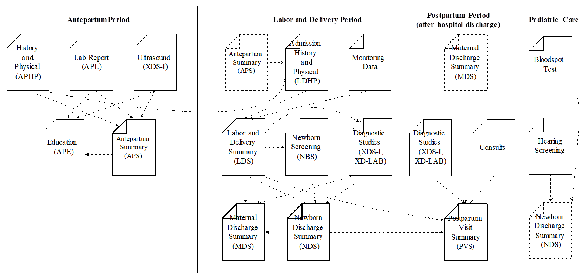

# Mothers
Mothers are great, we all have one

# Intro
During a normal pregnancy, a mother will undergo several encounters in an obstetric setting.  These encounters will track the progression of the pregnancy.  Diagnostic tests, such as labs and imaging studies will be ordered, and the results incorporated into the record of care for the antepartum period.  As the expectant mother nears her delivery date, many of these records will  be shared with the delivery location. 

In the delivery setting, the mother will undergo an admission history and physical.  The mother and fetus will be monitored as labor progresses and additional diagnostic tests may be ordered.  The mother may be placed on an infusion pump.  Eventually the delivery will be performed.  The baby (or babies in the case of multiple birth) may be monitored, as may the mother post delivery.  A labor and delivery summary will be produced which describes the outcome for both the mother and the newly delivered baby (or babies). 

The baby will be admitted, and undergo a more complete evaluation at that time.  Additional tests on the newborn will be performed (e.g., the newborn blood spot test and a hearing screening).  Vital records data will be collected and sent to the appropriate authorities to issue a certificate of birth.  Other consults for lactation, nutrition, and/or social services may also be necessary to for the mother and child.  The results of newborn screening tests (and possibly others) will be summarized in the newborn’s discharge summary.  Finally, the outcome of the delivery will also be summarized in the mother’s discharge summary.

After the discharge of the mother from the hospital, she will undergo follow up care, and more diagnostic tests and/ or procedures may be performed.  Finally, the mother will complete a final postpartum visit, which will summarize all the events that occurred since delivery.

Note that each period of care includes a document that summarizes the care than went on in that period (shown in bold) and supports transfers of care into the next period.  This document transfers into the the next period (dotted outline) and is used to supply relevant data during that period of care.

Records for each period are maintained in folders in the information exchange.  The folders are marked with codes that describe their content.  The codes used for these folders are prescribed by each region that implements the profile in National Extensions as different countries use different coding systems to represent these collections of data.  IHE recommends a set of codes that  may be used, and the codes that are selected by the National Extensions should represent the same concepts.  The folders also have textual names that describe the data that they contain.  This profile makes some recommendations about the names, but leaves the formal specification of these textual names to be defined by the affinity domain.  To ensure patient privacy, patient identifying characteristics should not be used in folder names (e.g., Jane Doe’s First Pregnancy).

This profile specifies four folders that are created and used by the information systems used during the antepartum, labor and delivery, and postpartum periods for the mother and the newborn period for the baby.  These are specified in PCC TF-2:6.A, 6.L, 6.N and 6.P.  These folders must be created at the appropriate times by information systems when they share content.  Where possible[1], these systems first search for a folder of an appropriate type in the Health Information Exchange.  If an appropriate folder can be found, it should be verified by the user before new documents are added to it.  If an appropriate folder cannot be found the system must create it in the first submission that is exchanged.

# Resources availble from IHE

- blah
- blah
